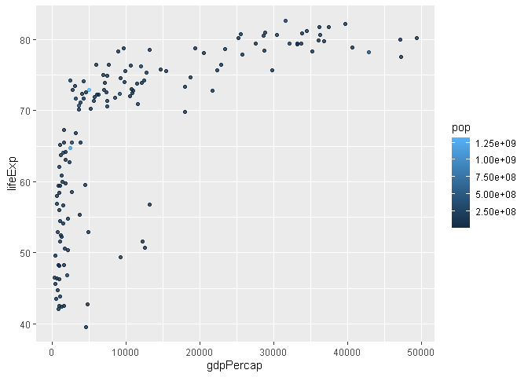

# Class 05: Data Visualization with GGPLOT
Chloe Wong (PID: A16893383)

## Plotting in R

> Q1. For which phases is data visualization important in our scientific
> workflows? All of the above.

> Q2. True or False? The ggplot2 package comes already installed with R?
> FALSE

R has lots of ways to mke plots and figures. This includes so-called
**base** graphics and packages like **ggplot2**

``` r
plot(cars)
```


This is a **base** R plot of the in-built `cars` dataset that has only
two columns:

``` r
head(cars)
```

      speed dist
    1     4    2
    2     4   10
    3     7    4
    4     7   22
    5     8   16
    6     9   10

> Q. How would we plot this wee dataset with **ggplot2**?

> Q3. Which plot types are typically NOT used to compare distributions
> of numeric variables? Network graphs

> Q4. Which statement about data visualization with ggplot2 is
> incorrect? ggplot2 is the only way to create plots in R

All ggplot figures have at least 3 layers:

- **data**
- **aes** (how the data map to the plot)
- **geoms** (how we draw the plot, lines, points, etc.)

Before I use any new package I need to download and install it with the
`install.packages()` command.

I never use `install.packages()` within my quarto document otherwise I
will install the package over and over and over again - which is silly!

Once a package is installed I can load it up with the `library()`
function.

``` r
# install.packages("ggplot2")
library(ggplot2)

ggplot(cars) +
  aes(x=speed, y=dist) +
  geom_point()
```


**Key-point**: For simple plots (like the one above) ggplot is more
verbose (we need to do more typing) but as plots get more complicated
ggplot starts to be more clear and simple than base R plot()

``` r
ggplot(cars) +
  aes(speed, dist) +
  geom_point() +
  geom_smooth(method = "lm", se = FALSE) +
  labs(title="Stopping distance of old cars", subtitle= "From the in-bult cars dataset") +
  theme_bw()
```

    `geom_smooth()` using formula = 'y ~ x'


> Q5. Which geometric layer should be used to create scatter plots in
> ggplot2? geom_point()

Put all your code in here

``` r
url <- "https://bioboot.github.io/bimm143_S20/class-material/up_down_expression.txt"
genes <- read.delim(url)
head(genes)
```

            Gene Condition1 Condition2      State
    1      A4GNT -3.6808610 -3.4401355 unchanging
    2       AAAS  4.5479580  4.3864126 unchanging
    3      AASDH  3.7190695  3.4787276 unchanging
    4       AATF  5.0784720  5.0151916 unchanging
    5       AATK  0.4711421  0.5598642 unchanging
    6 AB015752.4 -3.6808610 -3.5921390 unchanging

``` r
nrow(genes)
```

    [1] 5196

``` r
colnames(genes)
```

    [1] "Gene"       "Condition1" "Condition2" "State"     

``` r
ncol(genes)
```

    [1] 4

``` r
table(genes$State)
```


          down unchanging         up 
            72       4997        127 

``` r
round(table(genes$State)/nrow(genes) * 100, 2)
```


          down unchanging         up 
          1.39      96.17       2.44 

> Q6. Use the nrow() function to find out how many genes are in this
> dataset. What is your answer? 5196

> Q7. Use the colnames() function and the ncol() function on the genes
> data frame to find out what the column names are (we will need these
> later) and how many columns there are. How many columns did you find?
> 4

> Q8. Use the table() function on the State column of this data.frame to
> find out how many ‘up’ regulated genes there are. What is your answer?
> 127

> Q9. Using your values above and 2 significant figures. What fraction
> of total genes is up-regulated in this dataset? 2.44

`nrow()` and `ncol()` `table()` is very useful for getting counts
finally `round()`

A first plot:

``` r
p <- ggplot(genes) +
  aes(x=Condition1, y=Condition2, col=State) +
  geom_point()
```

Change the color scale so unchanging genes are not so obvious as I want
to highlight the Up and Down genes.

``` r
p + theme_bw() +
  scale_colour_manual( values=c("blue","gray","red") ) +
labs(title="Gene Expresion Changes Upon Drug Treatment",
         x="Control (no drug) ",
         y="Drug Treatment")
```


**Going Further**

``` r
url <- "https://raw.githubusercontent.com/jennybc/gapminder/master/inst/extdata/gapminder.tsv"

gapminder <- read.delim(url)

library(dplyr)
```


    Attaching package: 'dplyr'

    The following objects are masked from 'package:stats':

        filter, lag

    The following objects are masked from 'package:base':

        intersect, setdiff, setequal, union

``` r
gapminder_2007 <- gapminder %>% filter(year==2007)

library(ggplot2)

ggplot(gapminder_2007) +
  aes(x=gdpPercap, y=lifeExp) +
  geom_point(alpha=0.5)
```


``` r
ggplot(gapminder_2007) + 
  aes(x = gdpPercap, y = lifeExp, color = pop) +
  geom_point(alpha=0.8)
```



``` r
ggplot(gapminder_2007) + 
  aes(x = gdpPercap, y = lifeExp, size = pop) +
  geom_point(alpha=0.5)
```


``` r
ggplot(gapminder_2007) + 
  geom_point(aes(x = gdpPercap, y = lifeExp,
                 size = pop), alpha=0.5) + 
  scale_size_area(max_size = 10)
```


``` r
gapminder_1957 <- gapminder %>% filter(year==1957)

ggplot(gapminder_1957) + 
  aes(x = gdpPercap, y = lifeExp, color=continent,
                 size = pop) +
  geom_point(alpha=0.7) + 
  scale_size_area(max_size = 10) 
```


> Q. How many years are in this dataset?

``` r
length(gapminder$year)
```

    [1] 1704

``` r
table(gapminder$year)
```


    1952 1957 1962 1967 1972 1977 1982 1987 1992 1997 2002 2007 
     142  142  142  142  142  142  142  142  142  142  142  142 

``` r
unique(gapminder$year)
```

     [1] 1952 1957 1962 1967 1972 1977 1982 1987 1992 1997 2002 2007

``` r
length(unique(gapminder$year))
```

    [1] 12

``` r
library(dplyr)
```

``` r
filter(gapminder, country=="United States")
```

             country continent year lifeExp       pop gdpPercap
    1  United States  Americas 1952  68.440 157553000  13990.48
    2  United States  Americas 1957  69.490 171984000  14847.13
    3  United States  Americas 1962  70.210 186538000  16173.15
    4  United States  Americas 1967  70.760 198712000  19530.37
    5  United States  Americas 1972  71.340 209896000  21806.04
    6  United States  Americas 1977  73.380 220239000  24072.63
    7  United States  Americas 1982  74.650 232187835  25009.56
    8  United States  Americas 1987  75.020 242803533  29884.35
    9  United States  Americas 1992  76.090 256894189  32003.93
    10 United States  Americas 1997  76.810 272911760  35767.43
    11 United States  Americas 2002  77.310 287675526  39097.10
    12 United States  Americas 2007  78.242 301139947  42951.65

> Q. Extract data for the US in 1992.

``` r
filter(gapminder, country=="United States", year=="1992")
```

            country continent year lifeExp       pop gdpPercap
    1 United States  Americas 1992   76.09 256894189  32003.93

> Q. Wht is the population of Ireland in the last year we have data for?

``` r
filter(gapminder, country=="Ireland", year=="2007")
```

      country continent year lifeExp     pop gdpPercap
    1 Ireland    Europe 2007  78.885 4109086     40676

> Q. What countries in data set had pop smller than Ireland in 2007?

- First limit/subset the dataset to the year 2007

``` r
gap07 <- filter(gapminder, year==2007)
```

- Then find the `pop` value for Ireland

``` r
ire_pop <- filter(gap07, country=="Ireland")["pop"]
ire_pop
```

          pop
    1 4109086

- Then extract all rows with `pop` less than Ireland’s

``` r
filter(gap07, pop < 4109086)
```

                     country continent year lifeExp     pop  gdpPercap
    1                Albania    Europe 2007  76.423 3600523  5937.0295
    2                Bahrain      Asia 2007  75.635  708573 29796.0483
    3               Botswana    Africa 2007  50.728 1639131 12569.8518
    4                Comoros    Africa 2007  65.152  710960   986.1479
    5            Congo, Rep.    Africa 2007  55.322 3800610  3632.5578
    6               Djibouti    Africa 2007  54.791  496374  2082.4816
    7      Equatorial Guinea    Africa 2007  51.579  551201 12154.0897
    8                  Gabon    Africa 2007  56.735 1454867 13206.4845
    9                 Gambia    Africa 2007  59.448 1688359   752.7497
    10         Guinea-Bissau    Africa 2007  46.388 1472041   579.2317
    11               Iceland    Europe 2007  81.757  301931 36180.7892
    12               Jamaica  Americas 2007  72.567 2780132  7320.8803
    13                Kuwait      Asia 2007  77.588 2505559 47306.9898
    14               Lebanon      Asia 2007  71.993 3921278 10461.0587
    15               Lesotho    Africa 2007  42.592 2012649  1569.3314
    16               Liberia    Africa 2007  45.678 3193942   414.5073
    17            Mauritania    Africa 2007  64.164 3270065  1803.1515
    18             Mauritius    Africa 2007  72.801 1250882 10956.9911
    19              Mongolia      Asia 2007  66.803 2874127  3095.7723
    20            Montenegro    Europe 2007  74.543  684736  9253.8961
    21               Namibia    Africa 2007  52.906 2055080  4811.0604
    22                  Oman      Asia 2007  75.640 3204897 22316.1929
    23                Panama  Americas 2007  75.537 3242173  9809.1856
    24           Puerto Rico  Americas 2007  78.746 3942491 19328.7090
    25               Reunion    Africa 2007  76.442  798094  7670.1226
    26 Sao Tome and Principe    Africa 2007  65.528  199579  1598.4351
    27              Slovenia    Europe 2007  77.926 2009245 25768.2576
    28             Swaziland    Africa 2007  39.613 1133066  4513.4806
    29   Trinidad and Tobago  Americas 2007  69.819 1056608 18008.5092
    30               Uruguay  Americas 2007  76.384 3447496 10611.4630
    31    West Bank and Gaza      Asia 2007  73.422 4018332  3025.3498

``` r
gapminder_1957 <- gapminder %>% filter(year==1957 | year==2007)

ggplot(gapminder_1957) + 
  geom_point(aes(x = gdpPercap, y = lifeExp, color=continent,
                 size = pop), alpha=0.7) + 
  scale_size_area(max_size = 10) +
  facet_wrap(~year)
```


**OPTIONAL: Bar Charts**

``` r
gapminder_top5 <- gapminder %>% 
  filter(year==2007) %>% 
  arrange(desc(pop)) %>% 
  top_n(5, pop)

gapminder_top5
```

            country continent year lifeExp        pop gdpPercap
    1         China      Asia 2007  72.961 1318683096  4959.115
    2         India      Asia 2007  64.698 1110396331  2452.210
    3 United States  Americas 2007  78.242  301139947 42951.653
    4     Indonesia      Asia 2007  70.650  223547000  3540.652
    5        Brazil  Americas 2007  72.390  190010647  9065.801

``` r
ggplot(gapminder_top5) + 
  geom_col(aes(x = country, y = pop))
```


``` r
ggplot(gapminder_top5) + 
  geom_col(aes(x = country, y = pop, fill = continent))
```


``` r
ggplot(gapminder_top5) + 
  geom_col(aes(x = country, y = pop, fill = lifeExp))
```


``` r
ggplot(gapminder_top5) +
  aes(x=country, y=pop, fill=gdpPercap) +
  geom_col()
```


``` r
ggplot(gapminder_top5) +
  aes(x=reorder(country, -pop), y=pop, fill=gdpPercap) +
  geom_col()
```


``` r
ggplot(gapminder_top5) +
  aes(x=reorder(country, -pop), y=pop, fill=country) +
  geom_col(col="gray30") +
  guides(fill="none")
```


``` r
head(USArrests)
```

               Murder Assault UrbanPop Rape
    Alabama      13.2     236       58 21.2
    Alaska       10.0     263       48 44.5
    Arizona       8.1     294       80 31.0
    Arkansas      8.8     190       50 19.5
    California    9.0     276       91 40.6
    Colorado      7.9     204       78 38.7

``` r
USArrests$State <- rownames(USArrests)
ggplot(USArrests) +
  aes(x=reorder(State,Murder), y=Murder) +
  geom_col() +
  coord_flip()
```


``` r
ggplot(USArrests) +
  aes(x=reorder(State,Murder), y=Murder) +
  geom_point() +
  geom_segment(aes(x=State, 
                   xend=State, 
                   y=0, 
                   yend=Murder), color="blue") +
  coord_flip()
```


**Extensions: Animation**

``` r
library(gapminder)
library(gganimate)

ggplot(gapminder, aes(gdpPercap, lifeExp, size = pop, colour = country)) +
  geom_point(alpha = 0.7, show.legend = FALSE) +
  scale_colour_manual(values = country_colors) +
  scale_size(range = c(2, 12)) +
  scale_x_log10() +
  # Facet by continent
  facet_wrap(~continent) +
  # Here comes the gganimate specific bits
  labs(title = 'Year: {frame_time}', x = 'GDP per capita', y = 'life expectancy') +
  transition_time(year) +
  shadow_wake(wake_length = 0.1, alpha = FALSE)
```

**Combining Plots**

``` r
library(patchwork)

p1 <- ggplot(mtcars) + geom_point(aes(mpg, disp))
p2 <- ggplot(mtcars) + geom_boxplot(aes(gear, disp, group = gear))
p3 <- ggplot(mtcars) + geom_smooth(aes(disp, qsec))
p4 <- ggplot(mtcars) + geom_bar(aes(carb))

(p1 | p2 | p3) /
      p4
```

    `geom_smooth()` using method = 'loess' and formula = 'y ~ x'


**About this document**

``` r
sessionInfo()
```

    R version 4.4.1 (2024-06-14 ucrt)
    Platform: x86_64-w64-mingw32/x64
    Running under: Windows 10 x64 (build 19045)

    Matrix products: default


    locale:
    [1] LC_COLLATE=English_United States.utf8 
    [2] LC_CTYPE=English_United States.utf8   
    [3] LC_MONETARY=English_United States.utf8
    [4] LC_NUMERIC=C                          
    [5] LC_TIME=English_United States.utf8    

    time zone: America/Los_Angeles
    tzcode source: internal

    attached base packages:
    [1] stats     graphics  grDevices utils     datasets  methods   base     

    other attached packages:
    [1] patchwork_1.3.0 dplyr_1.1.4     ggplot2_3.5.1  

    loaded via a namespace (and not attached):
     [1] vctrs_0.6.5       nlme_3.1-164      cli_3.6.3         knitr_1.48       
     [5] rlang_1.1.4       xfun_0.48         generics_0.1.3    jsonlite_1.8.9   
     [9] labeling_0.4.3    glue_1.8.0        colorspace_2.1-1  htmltools_0.5.8.1
    [13] scales_1.3.0      fansi_1.0.6       rmarkdown_2.28    grid_4.4.1       
    [17] evaluate_1.0.1    munsell_0.5.1     tibble_3.2.1      fastmap_1.2.0    
    [21] yaml_2.3.10       lifecycle_1.0.4   compiler_4.4.1    pkgconfig_2.0.3  
    [25] mgcv_1.9-1        rstudioapi_0.17.1 lattice_0.22-6    farver_2.1.2     
    [29] digest_0.6.37     R6_2.5.1          tidyselect_1.2.1  utf8_1.2.4       
    [33] splines_4.4.1     pillar_1.9.0      magrittr_2.0.3    Matrix_1.7-0     
    [37] withr_3.0.1       tools_4.4.1       gtable_0.3.5     
