# Class 7: Machine Learning
Chloe Wong (PID: A16893383)

Today we are going to learn how to apply different machine learning
methods, beginning with clustering:

The goal here is to find groups/clusters in your input data.

First I will make up some data with clear groups. For this I will use
the `rnorm()` function:

``` r
rnorm(10)
```

     [1]  0.35799039  0.44920962  1.29070746  1.33118677 -0.80364901 -0.05091398
     [7]  0.20282386  0.60607519  1.54167256 -0.67125669

``` r
hist( rnorm(10000, mean = 3))
```

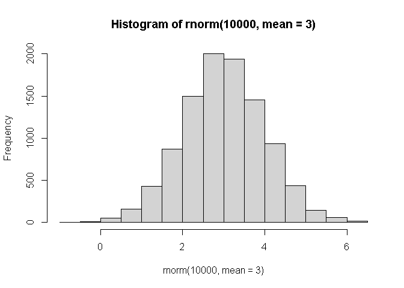

``` r
n <- 10000
x <- c(rnorm(n, -3), rnorm(n, +3))
hist(x)
```

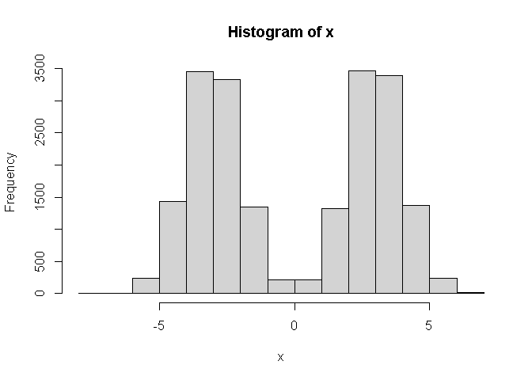

``` r
n <- 30
x <- c(rnorm(n, -3), rnorm(n, +3))
y <- rev(x)

z <- cbind(x,y)
head(z)
```

                 x        y
    [1,] -3.338238 3.816610
    [2,] -2.894614 4.639969
    [3,] -2.732173 2.152208
    [4,] -4.213050 1.114971
    [5,] -2.516812 2.677425
    [6,] -1.746608 3.528747

``` r
plot(z)
```

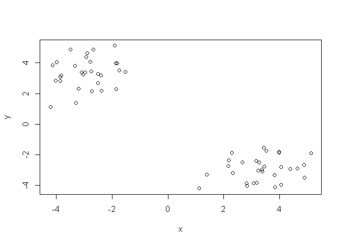

Use the `kmeans()` function setting k to 2 and nstart=20

Inspect/print the results

> Q. How many points are in each cluster? There are 60 points in each
> cluster.

> Q. What ‘component’ of your result object details - cluster size? -
> cluster assignment/membership? - cluster center? Answered below.

> Q. Plot x colored by the kmeans cluster assignment and add cluster
> centers as blue points. Answered below.

``` r
km <- kmeans(z, centers = 2)
km
```

    K-means clustering with 2 clusters of sizes 30, 30

    Cluster means:
             x        y
    1 -2.92258  3.35088
    2  3.35088 -2.92258

    Clustering vector:
     [1] 1 1 1 1 1 1 1 1 1 1 1 1 1 1 1 1 1 1 1 1 1 1 1 1 1 1 1 1 1 1 2 2 2 2 2 2 2 2
    [39] 2 2 2 2 2 2 2 2 2 2 2 2 2 2 2 2 2 2 2 2 2 2

    Within cluster sum of squares by cluster:
    [1] 45.60924 45.60924
     (between_SS / total_SS =  92.8 %)

    Available components:

    [1] "cluster"      "centers"      "totss"        "withinss"     "tot.withinss"
    [6] "betweenss"    "size"         "iter"         "ifault"      

Results in kmeans object `km`

``` r
attributes(km)
```

    $names
    [1] "cluster"      "centers"      "totss"        "withinss"     "tot.withinss"
    [6] "betweenss"    "size"         "iter"         "ifault"      

    $class
    [1] "kmeans"

Cluster size?

``` r
km$size
```

    [1] 30 30

Cluster Assignment/membership?

``` r
km$cluster
```

     [1] 1 1 1 1 1 1 1 1 1 1 1 1 1 1 1 1 1 1 1 1 1 1 1 1 1 1 1 1 1 1 2 2 2 2 2 2 2 2
    [39] 2 2 2 2 2 2 2 2 2 2 2 2 2 2 2 2 2 2 2 2 2 2

Cluster center?

``` r
km$centers
```

             x        y
    1 -2.92258  3.35088
    2  3.35088 -2.92258

> Q. Plot x colored by the kmeans cluster assignment and add cluster
> centers as blue points.

``` r
plot(z, col= "red")
```

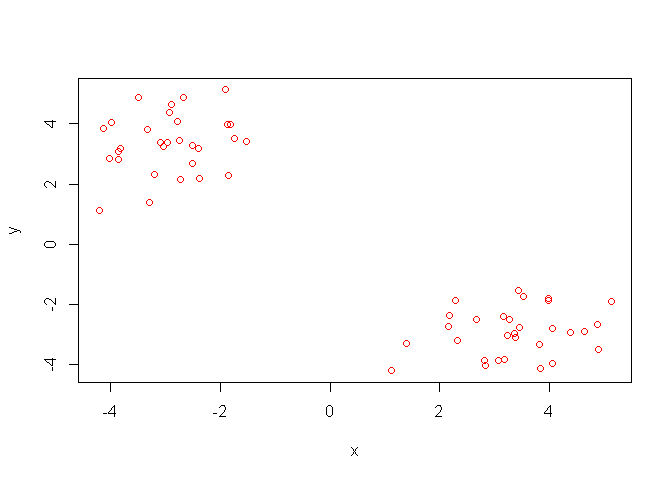

R will re-cycle the shorter color vector to be the same length as the
longer number od data points) in z

``` r
plot(z, col= c("red","blue"))
```

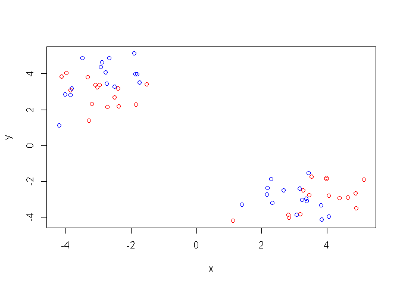

``` r
plot(z, col=c(1,2))
```

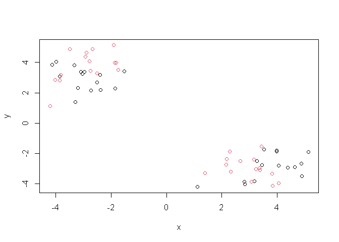

``` r
plot(z, col=km$cluster)
points(km$centers, col = "blue", pch = 15, cex = 3)
```

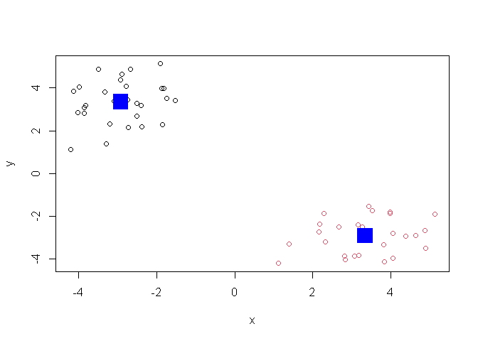

> Q. Can you run kmeans and ask for 4 clusters please and plot the
> results like we have done above?

``` r
km4 <- kmeans(z, centers = 4)
plot(z, col=km4$cluster)
points(km4$centers, col = "blue", pch = 15, cex = 3)
```

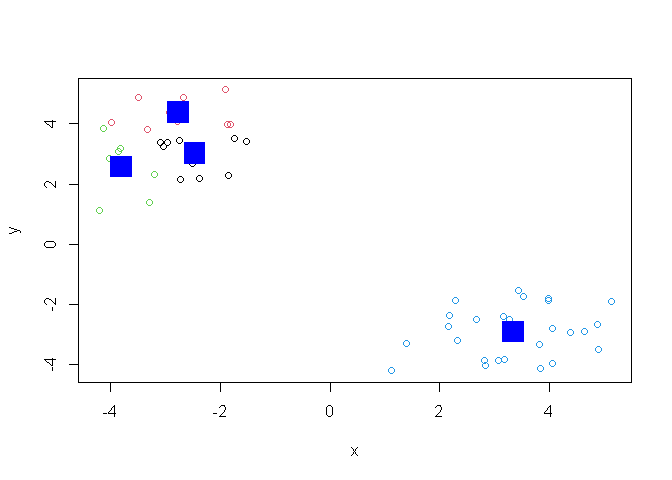

\##Hierarchical Clustering

Let’s tke our same made-up data `z` and see how hclust works.

First we need a distance matrix of our data to be clustered.

``` r
d <- dist(z)
hc <- hclust(d)
hc
```


    Call:
    hclust(d = d)

    Cluster method   : complete 
    Distance         : euclidean 
    Number of objects: 60 

``` r
plot(hc)
abline(h=8, col="red")
```

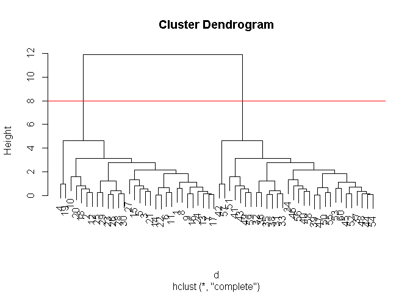

I can get my cluster membership vector by “cutting the tree” with the
`cutree()` function like so:

``` r
grps <- cutree(hc, h=8)
grps
```

     [1] 1 1 1 1 1 1 1 1 1 1 1 1 1 1 1 1 1 1 1 1 1 1 1 1 1 1 1 1 1 1 2 2 2 2 2 2 2 2
    [39] 2 2 2 2 2 2 2 2 2 2 2 2 2 2 2 2 2 2 2 2 2 2

Can you plot `z` colored by our hclust results:

``` r
plot(z, col=grps)
```


\##PCA of UK food data

Read data from the UK on food consumption in different parts of the UK

``` r
url <- "https://tinyurl.com/UK-foods"
x <- read.csv(url, row.names=1)
head(x)
```

                   England Wales Scotland N.Ireland
    Cheese             105   103      103        66
    Carcass_meat       245   227      242       267
    Other_meat         685   803      750       586
    Fish               147   160      122        93
    Fats_and_oils      193   235      184       209
    Sugars             156   175      147       139

``` r
barplot(as.matrix(x), beside=F, col=rainbow(nrow(x)))
```

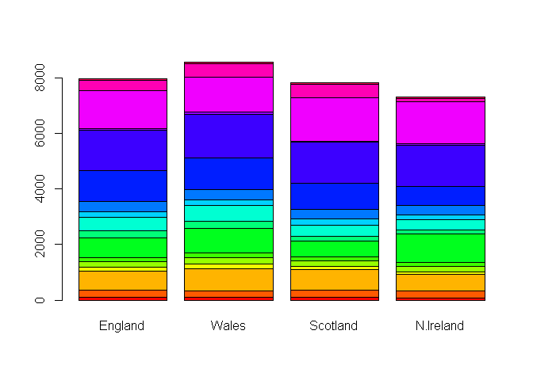

A so-called “Pairs” plot can be useful for small datasets like this one

``` r
pairs(x, col=rainbow(10), pch=16)
```

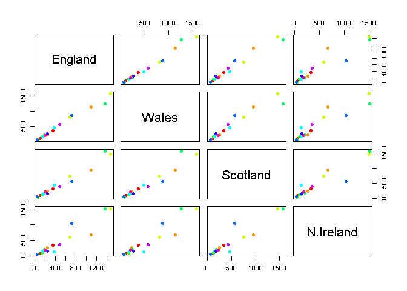

It is hard to see structure and trends in even this small data-set. How
will we ever do this when we have big datasets with 1,000s or 10s of
thousands of things we are measuring…

### PCA to the resure

Let’s see how PCA deals with this dataset. So main function in base R to
do PCA is called `prcomp()`

``` r
pca <- prcomp( t(x) )
summary(pca)
```

    Importance of components:
                                PC1      PC2      PC3       PC4
    Standard deviation     324.1502 212.7478 73.87622 3.176e-14
    Proportion of Variance   0.6744   0.2905  0.03503 0.000e+00
    Cumulative Proportion    0.6744   0.9650  1.00000 1.000e+00

Let’s see what is inside this `pca` object that we created from running
`prcomp()`

``` r
attributes(pca)
```

    $names
    [1] "sdev"     "rotation" "center"   "scale"    "x"       

    $class
    [1] "prcomp"

``` r
pca$x
```

                     PC1         PC2        PC3           PC4
    England   -144.99315   -2.532999 105.768945 -4.894696e-14
    Wales     -240.52915 -224.646925 -56.475555  5.700024e-13
    Scotland   -91.86934  286.081786 -44.415495 -7.460785e-13
    N.Ireland  477.39164  -58.901862  -4.877895  2.321303e-13

``` r
plot(pca$x[,1], pca$x[,2], 
  col=c("black", "red", "blue", "darkgreen"), pch=16,
  xlab="PC1 (67.4%)", ylab="PC2 (29%)")
```

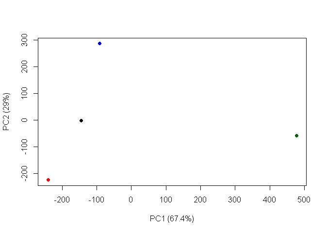

## Lets focus on PC1 as it accounts for \> 90% of variance

``` r
par(mar=c(10, 3, 0.35, 0))
barplot( pca$rotation[,1], las=2 )
```

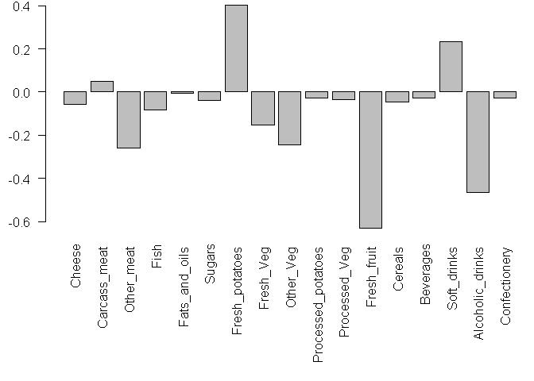
